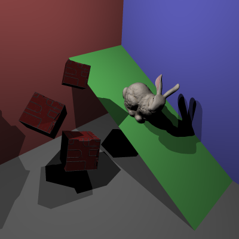

[](https://classroom.github.com/a/oMRiv2DB)
# COMP30019 - Project 1 - Ray Tracer

This is your README.md... you should write anything relevant to your
implementation here.

Please ensure your student details are specified below (*exactly* as on UniMelb
records):

**Name:** Ling Wei Teh \
**Student Number:** 1462878 \
**Username:** lingweit \
**Email:** lingweit@student.unimelb.edu.au

## Completed stages

Tick the stages bellow that you have completed so we know what to mark (by
editing README.md). **At most 3** add-ons can be chosen for marking of stage three. If you complete more than this, pick your best one(s) to be marked, otherwise we will pick at random!

<!---
Tip: To tick, place an x between the square brackes [ ], like so: [x]
-->

##### Stage 1

- [x] Stage 1.1 - Familiarise yourself with the template
- [x] Stage 1.2 - Implement vector mathematics
- [x] Stage 1.3 - Fire a ray for each pixel
- [x] Stage 1.4 - Calculate ray-entity intersections
- [x] Stage 1.5 - Output primitives as solid colours

##### Stage 2

- [x] Stage 2.1 - Illumination
- [x] Stage 2.2 - Shadow rays
- [x] Stage 2.3 - Reflection rays
- [x] Stage 2.4 - Refraction rays
- [x] Stage 2.5 - The Whitted Illumination Model

##### Stage 3

- [x] Stage 3.1 - Advanced features
- [ ] Stage 3.2 - Advanced add-ons
  - [x] A.1 - Anti-aliasing
  - [ ] A.2 - Soft shadows
  - [ ] A.3 - Depth of field blur
  - [] A.4 - Motion blur
  - [x] B.1 - Color texture mapping
  - [x] B.2 - Bump or normal mapping
  - [ ] B.3 - Procedural textures
  - [ ] C.1 - Simple animation
  - [] C.2 - Keyframe animation
  - [] C.3 - Camera animation

*Please summarise your approach(es) to stage 3 here.*
For Stage 3.1, BVH data structure was implemented to drastically reduce the time complexity of OBJ rendering, turning an almost 15 minute render time to around 4-5 seconds. For custom cameras, I changed the hardcoded camera variables and instead used the camera's transforms and position/origin to orient the camera.

For Stage 3.2, I have decided to pick add-ons: B.1, B.2, A.1, that are focused around texturing and creating more realistic images. 

To begin, in part B.1 - Colour Texture Mapping, my approach began with modifying the ObjModel.cs to be able to parse in the texture coordinates which maps points in the 3D world space to points in a 2D image or in my case, the texture image. In my implementation, I passed the texture coordinates to the triangle class where the Intersect() method is called by ObjModels as it made the most sense to do texture calculations only when an intersection has occured. I then interpolated these texture coordinates with the barycentric coordinates of the triangle to compute the texture coordinates at the intersection point of the ray on the triangle's surface. Using the interpolated texture coordinates, I then mapped them to pixel coordinates with use of the Math.Clamp method to ensure the coordinates are within the bounds of the image, whereby I was able to extract the colour at that specific coordinate from the provided images. With this colour, I parsed it into RayHit, so that in my render function, I can check whether or not the texture colour exists, and use that instead of the diffuse colour.

Next, in part B.2 - Bump or Normal Mapping, my approach began with using the same interpolated texture coordinates calculated in part B.1. I first added a check for whether or not a NormalMap exists to resolve and potential errors. In a similar manner as part B.3, I mapped the texture coordinates to pixel coordinates of the normal map to extract the RGB pattern, ensuring to map the RGB values from [0,1] to [-1, 1] as these the values serve as a direction vector of sorts. Next I calculated the tangent and bitangent, with the former pointing in the direction of increasing u (the horizontal texture coordinate) and the latter pointing in the direction of increasing v (the vetical texture coordinate). With all the parts calculated, I computed the pertubed surface normal and replaced the geometric normal with it to be used in light and shadow calculations.

Finally, part A.1 - Anti-aliasing. I approached this task by researching about methods of Anti-aliasing, and learnt that there were multiple types of which I only really considered two: SSAA and MSAA. Whilst SSAA has the benefit of being relatively easy to implement, I did have some concerns as to the performance cost. And so, I chose MSAA, which followed the ray sampling method of SSAA but did not calculate the color at every ray indiscriminately. Instead, MSAA only performs tracing on confirmed hits that are different in color. As such, MSAA provides a improvement in performance over SSAA which supports my choice in implementing it for this task. In terms of my actual implementation, I placed it in the Render function, and for each pixel, I split it into a uniform grid of AAMultiplier^2 points. Then I ran the relatively cheap intersection to check if each ray intersects any entity, and only then do I decide whether or not to trace the ray. By placing my implementation before color tracing, I potentially reduce a lot of unnecessary tracing which leads to an increase in performance.

## Final scene render

Be sure to replace ```/images/final_scene.png``` with your final render so it
shows up here.



This render took 1 minutes and 19 seconds on my PC.

I used the following command to render the image exactly as shown:

```
dotnet run -- -f tests/final_scene.txt -o output.png -x 4
```

## Sample outputs

We have provided you with some sample tests located at ```/tests/*```. So you
have some point of comparison, here are the outputs our ray tracer solution
produces for given command line inputs (for the first two stages, left and right
respectively):

###### Sample 1

```
dotnet run -- -f tests/sample_scene_1.txt -o images/sample_scene_1.png
```

<p float="left">
  
   
</p>

###### Sample 2

```
dotnet run -- -f tests/sample_scene_2.txt -o images/sample_scene_2.png
```

<p float="left">
  
   
</p>

## References

*You must list any references you used - add them here!*
https://www.scratchapixel.com
https://learn.microsoft.com/en-us/dotnet/csharp/language-reference/operators/operator-overloading
https://learn.microsoft.com/en-us/dotnet/api/system.string?view=net-9.0
http://codeplexarchive.org/project/magick
https://learnopengl.com/Introduction


